# Cell shape and ecological interaction in microbial range expansions

This repository studies one question with two models: how does the shape of
bacterial cells change the spatial outcome of an ecological interaction between
two strains in a growing colony. The two strains are assigned both a metabolic
role in an interaction and a cell shape, so any interaction can be run with
any pairing of the two cell shapes. The two models look at the same object from
two angles.

1. A three-dimensional cube model grows the colony inside a cubic domain and
   shows the qualitative spatial structure each interaction produces in 3D.
2. A two-dimensional range-expansion model grows the colony as a flat radial
   expansion seen from above. This is the model the quantitative spatial metrics
   and the statistical comparisons are computed from.

Both models share the same three cell shapes and the same six interaction sign
classes, and both depend only on NumPy, SciPy, Matplotlib and Pillow.

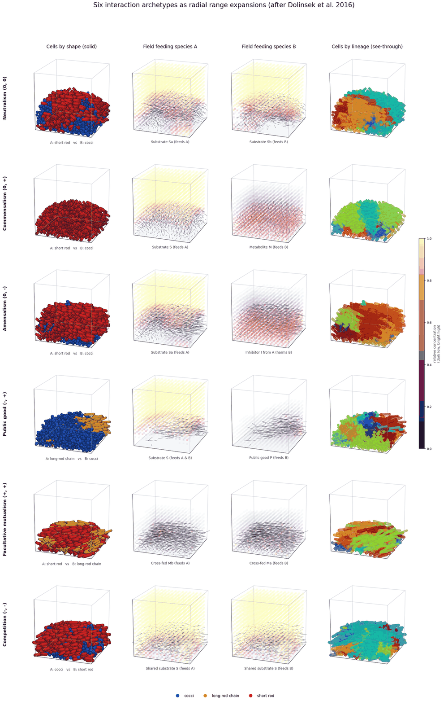

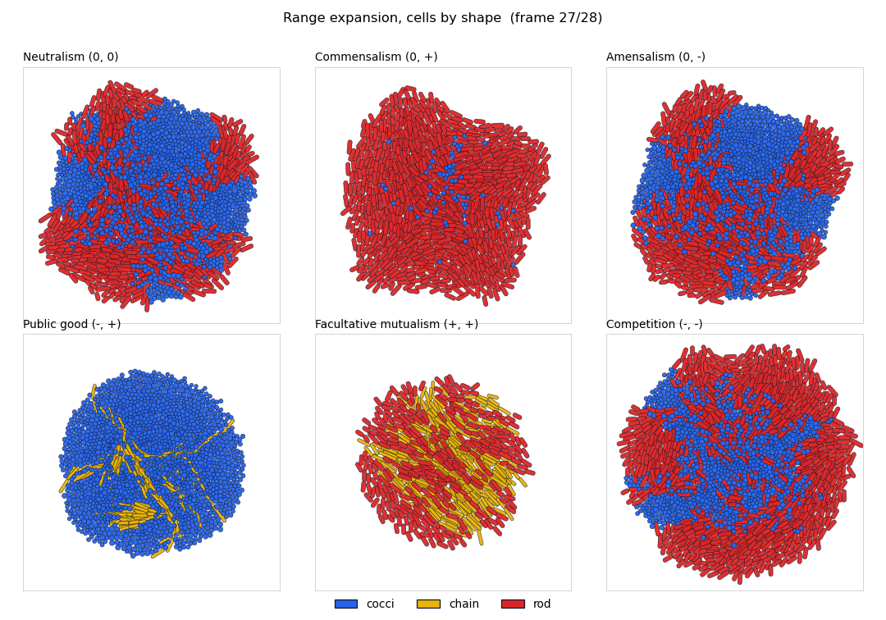

## Integrated view

The two models are looked at together in one figure. For every interaction the
same run is shown as a 3D cube and as a 2D range expansion, each coloured once by
cell shape (so every cell type is visible) and once by founding lineage (so every
lineage is visible). This is the single place where all six interactions, all
three cell types and all the lineages appear side by side in both models.

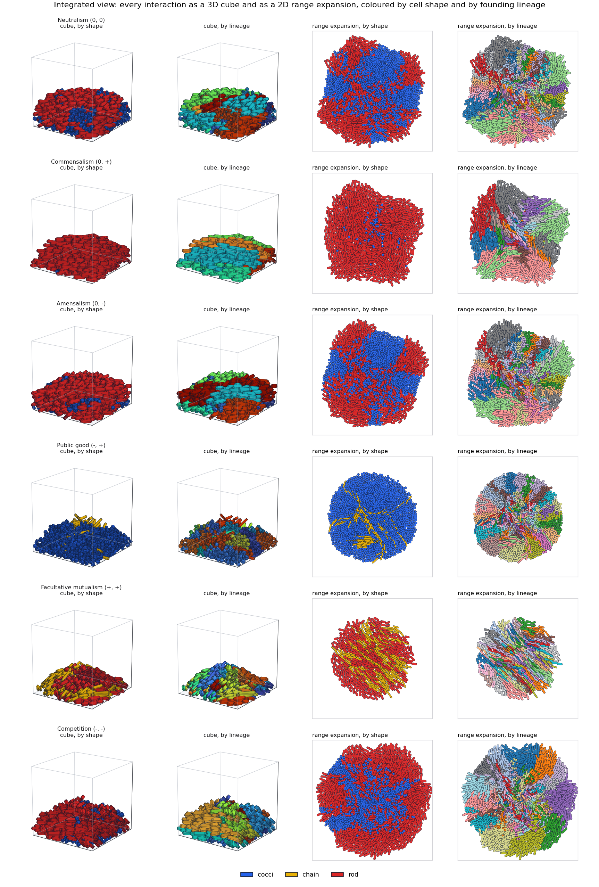

The animation `integrated_rangeexp.gif` shows the two models growing together,
cube on top and range expansion below, coloured by founding lineage, for all six
interactions at once.

## Reading order

The repository is meant to be read in three stages, which is also the order
`scripts/run_all.py` regenerates the figures:

1. **3D cube model.** Explore cell-shape interactions in three dimensions. Output
   files are the overview `figures/cube3d_multipanel.png` with its animation
   `figures/cube3d_multipanel.gif`, and the role-inversion figures
   `figures/cube3d_inversion.png` and `figures/cube3d_inversion_analysis.png`.
2. **Range-expansion model.** Explore the same interactions and shapes as a 2D
   radial range expansion. Output files are `figures/re_panels.png` and the
   animation `figures/re_rangeexp.gif`.
3. **Spatial metrics.** Calculate the spatial metrics and the shape-by-sign
   factorial to measure the effect of cell shape within each interaction. Output
   files are `figures/re_factorial.png` and `figures/re_*_byinteraction.png`.

## Which model the metrics come from

Every quantitative metric and every statistical test in this repository is
computed from the **2D range-expansion model**, from the arrays of cell
positions, founding lineages and strains at the end of a run. The 3D cube model
is used for the qualitative spatial picture and its own descriptive figures; it
is not the source of the comparative statistics. The shape-by-sign factorial,
the lineage-success rates, the travel distances and the frontier sector
statistics all read the range-expansion model. This is stated again at the top
of `src/metrics_re.py`.

The role-inversion control, which swaps the two cell shapes between the roles of
each interaction, is run in both models so the two can be cross-checked. Its
comparative statistics for the headline numbers still come from the
range-expansion model; the cube version is shown alongside to confirm the same
ordering holds in three dimensions.

## Repository layout

```
ecomodel/
  src/
    # ---- 3D cube model (used for the qualitative 3D picture) ----
    config3d.py        parameters for the 3D model
    field3d.py         scalar fields on a 3D grid
    cube3d.py          3D colony mechanics, morphologies, interactions
    render3d.py        3D rendering and panel GIFs
    render_shapes.py   shaded shape rendering
    analysis3d.py      descriptive 3D analyses
    stats3d.py         3D-side descriptive statistics

    # ---- 2D range-expansion model (used for all metrics) ----
    config_re.py       parameters for the range-expansion model
    field_re.py        scalar diffusion field on a 2D grid
    colony_re.py       2D colony: morphologies, biomass growth, frontier gating,
                       contact mechanics, genealogy
    interactions_re.py the six interaction sign classes in 2D
    sim_re.py          run driver (frontier-gated range expansion)
    render_re.py       capsule contours, strain, field and lineage panels, GIF
    metrics_re.py      frontier sector statistics and per-strain outcomes
  scripts/
    # 3D cube model, used in the default pipeline
    make_cube3d.py         overview panels and the cube animation
    make_cube3d_inversion.py   the cube role-inversion figures
    # 3D cube model, original descriptive scripts kept with the preserved model,
    # not run by the default pipeline
    make_cube3d_shapes.py  make_cube3d_lineage_matrix.py  make_cube3d_factorial.py
    make_cube3d_stats.py   make_cube3d_analysis.py  make_cube3d_control.py
    make_cube3d_spatialgen.py  make_cube3d_travel.py  make_cube3d_rangeexp.py
    # range expansion
    make_re_panels.py      strain, field with contours, lineage sectors, and GIF
    make_re_factorial.py   shape-by-sign factorial and per-interaction tests
    make_re_metrics.py     frontier sector statistics per interaction and shape
    make_re_inversion.py   each interaction with the cell shapes swapped between sides
    make_stats_report.py   complete per-combination statistics tables for the README
    make_integrated.py     both models side by side, by shape and by lineage, all interactions
    run_all.py             regenerate everything in reading order
  figures/   the kept PNG stills and the three essential GIFs
  README.md
```

## Cell shapes

Each strain is assigned one of three shapes. All three use the same biomass
unit, so no shape starts with a size advantage, and a cell of any shape doubles
its own birth biomass in the same time. The shapes are identical in the two
models.

| Shape | Geometry | Division rule | Resulting packing |
| --- | --- | --- | --- |
| Cocci | round cell, a capsule of zero length | grows until its area or volume reaches twice the birth value, then splits in a random direction | isotropic, no orientational order |
| Long-rod chain | slender capsule whose daughters stay mechanically bonded | grows in length, divides at a long division length, daughters stay linked | connected filaments with strong local orientation |
| Short rod | shorter capsule | grows in length, divides at a short length into separate cells | dense, locally aligned domains |

Each shape has one fixed colour used in every visualisation across both models
and the GIFs: cocci blue (`#2563eb`), chain yellow (`#eab308`), rod red
(`#dc2626`). The same palette colours the shape axis of the factorial plots.

## Interaction sign classes

The interactions are classified by the sign of the effect of each strain on the
other. There are six sign combinations and each model implements one
representative of each. The sign pair is written (effect on A, effect on B).

| Interaction | Sign pair | Role of A | Role of B | Coupling |
| --- | --- | --- | --- | --- |
| Neutralism | (0, 0) | independent | independent | A and B consume separate substrates and share no chemical |
| Commensalism | (0, +) | producer | consumer | A consumes S and secretes metabolite M; B grows only on M; A is unaffected |
| Amensalism | (0, -) | inhibitor maker | inhibited | A and B consume separate substrates; A secretes an inhibitor I that slows B; A is unaffected |
| Public good | (-, +) | producer paying a cost | free-rider | both consume S; A pays a growth cost to secrete a public good P that raises B's rate; B pays nothing |
| Facultative mutualism | (+, +) | cross-feeder | cross-feeder | each secretes a metabolite the other consumes; both grow faster together |
| Competition | (-, -) | competitor | competitor | both draw one shared substrate and so reduce it for the other |

The growth kinetics, costs, yields and diffusivities are kept equal between
`config3d.py` and `config_re.py`, so the two models differ only in dimension and
boundary geometry.

## Equations and mechanisms

The two models share the same biology. The growth kinetics, the six interaction
chemistries and the diffusion fields are identical; only the mechanics differ,
because one model is flat and the other has a third dimension and a floor. The
symbols below match the code in `src/interactions_re.py`, `src/colony_re.py` and
`src/field_re.py` for the range-expansion model, and in `src/cube3d.py`,
`src/config3d.py` and `src/field3d.py` for the cube model. Constants are
$g_{\max}=5.0$, $K_S=0.15$, $K_M=0.12$, $K_P=0.14$, consumption yield
$Y_c=1.80$, production yield $Y_p=0.055$, inhibitor constant $K_I=0.05$, public
good cost $c_{pg}=0.30$ and gain $\gamma=1.5$, mutualism floor $f_0=0.55$,
competition draw $\chi=1.6$.

### Growth rate and range-expansion gating

A cell takes up substrate with Monod kinetics, giving a metabolic rate

$$\mu = g_{\max}\,\frac{S}{K_S + S}.$$

In words, a cell grows faster when there is more food $S$ around it, and the rate
levels off at a ceiling $g_{\max}$ once food is plentiful.

The realised growth rate is this metabolic rate gated by two spatial factors, so
a cell grows only where it sits at the colony front and is supported by a crowd
of neighbours,

$$\mu_{\mathrm{eff}} = \mu \, f_{\mathrm{front}} \, f_{\mathrm{support}}.$$

The front factor reads how exposed a cell is from the resultant of the unit
vectors to its neighbours within a radius $r_f=3.2$,

$$\mathrm{res}_i = \frac{1}{n_i}\left\lVert \sum_{j\in\mathcal{N}_i} \hat{u}_{ij}\right\rVert,
\qquad
f_{\mathrm{front}} = \mathrm{clip}\!\left(\frac{\mathrm{res}_i-\ell_0}{\ell_1-\ell_0},\,0,\,1\right),$$

with $\ell_0=0.10$, $\ell_1=0.40$, then smoothed over neighbours. The support
factor reads how crowded the neighbourhood is, with $k_i$ neighbours inside
$r_s=2.2$ and $k_{\mathrm{full}}=5$,

$$f_{\mathrm{support}} = \mathrm{clip}\!\left(\frac{k_i}{k_{\mathrm{full}}},\,0,\,1\right).$$

Deep interior cells whose resultant is near zero are frozen and neither move nor
grow, which locks the inner mosaic while the rim advances. Both models use these
same two gates; the values above are for the flat model, and the cube model uses
its own neighbourhood sizes (front radius 2.2, support radius 1.9, full count 6).

### Biomass growth and division

Growth is on biomass, so a cell of any shape doubles its own birth size in the
same time (biomass is area in the flat model and volume in the cube model),

$$V_{t+\Delta t} = V_t + \mu_{\mathrm{eff}}\,V_{\mathrm{birth}}\,\Delta t,$$

and a cell divides when $V \ge 2\,V_{\mathrm{birth}}$. Cocci grow by radius (their
biomass is $\pi R^2$ in the plane and $\tfrac{4}{3}\pi R^3$ in the cube) and divide
in a random direction. Rods and chains grow by length (biomass $2RL + \pi R^2$ in
the plane, $\pi R^2 L + \tfrac{4}{3}\pi R^3$ in the cube) and divide along the long
axis; the two daughters each turn by an independent angle drawn from
$\mathcal{N}(0,\sigma^2)$ with $\sigma = 0.20$, so the cells turn a little at each
division and build curved domains, which keeps them from lining up into straight
radial spokes. Chained daughters stay mechanically bonded.

### Diffusion fields

Each chemical $c$ (substrate $S$, metabolite $M$, inhibitor $I$, public good $P$)
follows a reaction-diffusion equation solved by explicit substepping on the grid,

$$\frac{\partial c}{\partial t} = D_c \nabla^2 c - \lambda_c\, c + \sum_{\text{cells}} q_c,$$

In words, each chemical spreads out from where it is concentrated (the diffusion
term), slowly disappears if it decays (the decay term), and is added or removed by
the cells (the last term). The diffusion constants $D_S=0.4$, $D_M=D_P=4.0$ and
decays $\lambda_M=\lambda_P=0.02$ control how far and how long a chemical persists.
Substrate is
held at a fixed value on the plate border (Dirichlet reservoir) so the colony
draws a radial gradient as it consumes from the centre outward; secreted species
use no-flux edges (Neumann) so they stay concentrated next to the cells that make
them. The source and sink terms $q_c$ are set by the interaction.

### The six interactions

Each interaction is written as two parts. The first part is the growth rate of
each strain, $\mu_A$ and $\mu_B$, which says how fast a cell of that strain builds
biomass given the chemicals around it. The second part, written with a dot on top
of a chemical, is the rate at which that chemical changes at a cell: a minus sign
means the cell eats it, a plus sign means the cell makes it. The shorthand
$[x]_K = x/(K+x)$ is the saturating uptake curve, which rises with the amount of
chemical $x$ and levels off once $x$ is well above $K$, so doubling a scarce
chemical helps a lot and doubling an abundant one helps little.

Neutralism (0, 0), independent substrates:

$$\mu_A = g_{\max}[S_a]_{K_S},\quad \mu_B = g_{\max}[S_b]_{K_S},\qquad
\dot S_a = -Y_c\mu_A,\quad \dot S_b = -Y_c\mu_B.$$

Commensalism (0, +), the producer leaks a metabolite the consumer needs:

$$\mu_A = g_{\max}[S]_{K_S},\quad \mu_B = g_{\max}[M]_{0.4K_M},\qquad
\dot S = -Y_c\mu_A,\quad \dot M = 1.8\,Y_p\mu_A - Y_c\mu_B.$$

Amensalism (0, -), the producer leaks an inhibitor that slows the other:

$$\mu_A = g_{\max}[S_a]_{K_S},\quad \mu_B = \frac{g_{\max}[S_b]_{K_S}}{1 + I/K_I},\qquad
\dot S_a = -Y_c\mu_A,\quad \dot S_b = -Y_c\mu_B,\quad \dot I = 3\,Y_p\,g_{\max}[S_a]_{K_S}.$$

Public good (-, +), the producer pays a cost to make a shared good the free-rider
also uses, with base rate $\beta = g_{\max}[S]_{K_S}$:

$$\mu_A = \beta\,(1 - c_{pg}),\quad \mu_B = \beta\,(1 + \gamma\,[P]_{K_P}),\qquad
\dot S = -Y_c(\mu_A+\mu_B),\quad \dot P = Y_p\,\beta \ \text{(producer only)}.$$

Facultative mutualism (+, +), each feeds the other, with $s=[S]_{K_S}$:

$$\mu_A = g_{\max}\,s\,(f_0 + (1-f_0)[M_b]_{K_M}),\quad
\mu_B = g_{\max}\,s\,(f_0 + (1-f_0)[M_a]_{K_M}),$$
$$\dot M_a = Y_p\mu_A - \tfrac{1}{2}Y_c\mu_B,\quad
\dot M_b = Y_p\mu_B - \tfrac{1}{2}Y_c\mu_A.$$

Competition (-, -), both draw one shared substrate:

$$\mu_A = \mu_B = g_{\max}[S]_{K_S},\qquad \dot S = -\chi\,Y_c(\mu_A+\mu_B).$$

### Cell shapes and contacts

The three shapes are handled by one rule. A cocci cell is a sphere, which in the
flat model is a disc; it is a capsule of zero length. A rod or a chain link is a
spherocylinder, a straight body with a rounded cap at each end. Every cell has a
spine, which is a single point for a cocci cell and a line segment for a rod or chain,
and a radius $R$. Two cells touch when the gap between their spines is smaller than
the sum of their radii, so the surface overlap is

$$\delta_{ij} = (R_i + R_j) - d_{ij},$$

where $d_{ij}$ is the shortest distance between the two spines. A repulsion
proportional to $k_{\mathrm{rep}}\,\delta_{ij}$ pushes the pair apart along the
line joining the contact. An off-centre contact adds a torque that turns rods into
line with the cells they press on, two touching elongated cells feel a weak
alignment so a local patch points the same way, chained daughters are held
together by a spring at their end-to-end spacing, and every orientation carries a
small random jitter so the alignment stays local and the colony does not set into
one crystal. A cocci cell has no length, so it feels only the push, with no torque and
no alignment.

### Mechanics of the range-expansion model

The flat model resolves these contacts by overdamped relaxation: at each step
every overlap is turned into a small slide and turn and applied at once, with the
deep interior frozen in place. The colony grows outward in the plane as a disc.
Any cell that loses contact with the colony is removed, so the population stays
one connected front.

### Mechanics of the 3D cube model

The cube model adds the third dimension and a floor, and grows the same cells with
the same chemistry. The founders start as a small patch on the floor of the cube,
and the colony grows up and out from there, a range expansion spreading over a
surface. On top of the same contact rule it carries three further forces. The
floor pushes up on any part of a cell that dips below it, with stiffness
$k_{\mathrm{floor}}$. Gravity pulls every cell down and pulls harder on a poorly
supported one, so a cell poking up into open space is drawn back down onto the
colony. A lay-flat torque turns a protruding rod or chain back down into the
surface while leaving an embedded one alone, so filaments lie within the colony
and do not spike out of it. Rotation is slowed by a drag that grows with cell
length, so long cells turn slowly. The same front and support gates set where
growth happens, using the cube's own neighbourhood sizes.

## The range-expansion model in detail

A small mixed disk of founders is seeded at the centre of a square plate and the
colony grows outward. Cells expand by local growth, division and the displacement
of neighbours, under two spatial constraints. A cell judges how exposed it is
from the resultant of the unit vectors pointing to its neighbours, near 1 at the
rim and near 0 in the buried interior, and a second factor measures how crowded
its neighbourhood is. Growth is the product of the two, so a cell grows only when
it sits at the front and is supported by a surrounding crowd. An isolated cell
poking into empty space gets little support and barely grows, so the colony
advances as a dense, connected front and no cell runs off as a free spike. Any
cell that loses contact with the colony is dropped, so the population stays a
single connected biofilm. At each division the two daughters turn by independent
small angles, so the cells build curved, locally aligned domains and do not form
straight radial spokes. Substrate is supplied from the plate border,
so the colony draws a radial concentration gradient as it consumes from the
centre outward, and secreted molecules use zero-flux edges so they stay
concentrated next to the cells that make them. The renderer draws each cell as
its true spherocylinder outline, so the field panels show the nutrient or
metabolite as a heatmap with the cell contours drawn on top.

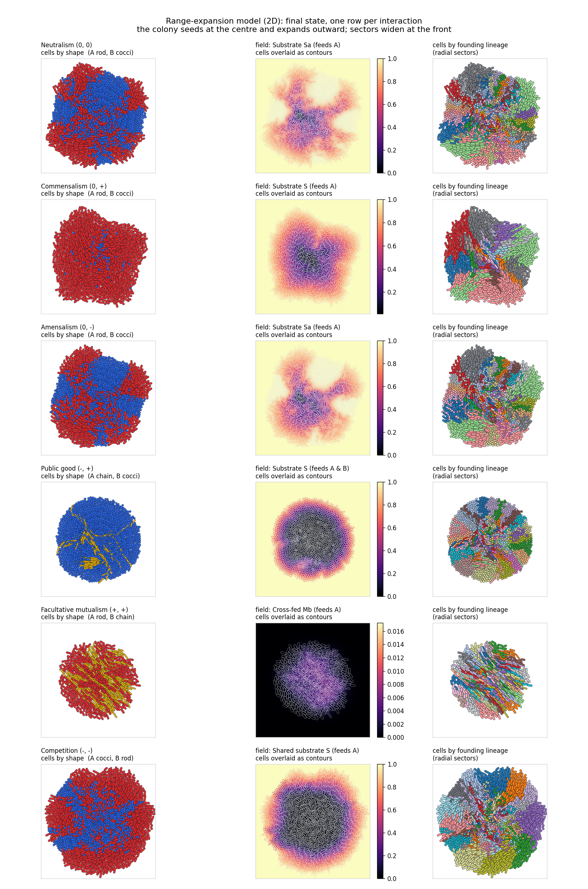

The three columns are, for each interaction, the cells coloured by shape (cocci
blue, chain yellow, rod red, the same shape colour code as the 3D cube model and
the GIFs), the first diffusion field as a heatmap with the cell contours drawn
over it, and the cells coloured by founding lineage so the radial sectors are
visible.

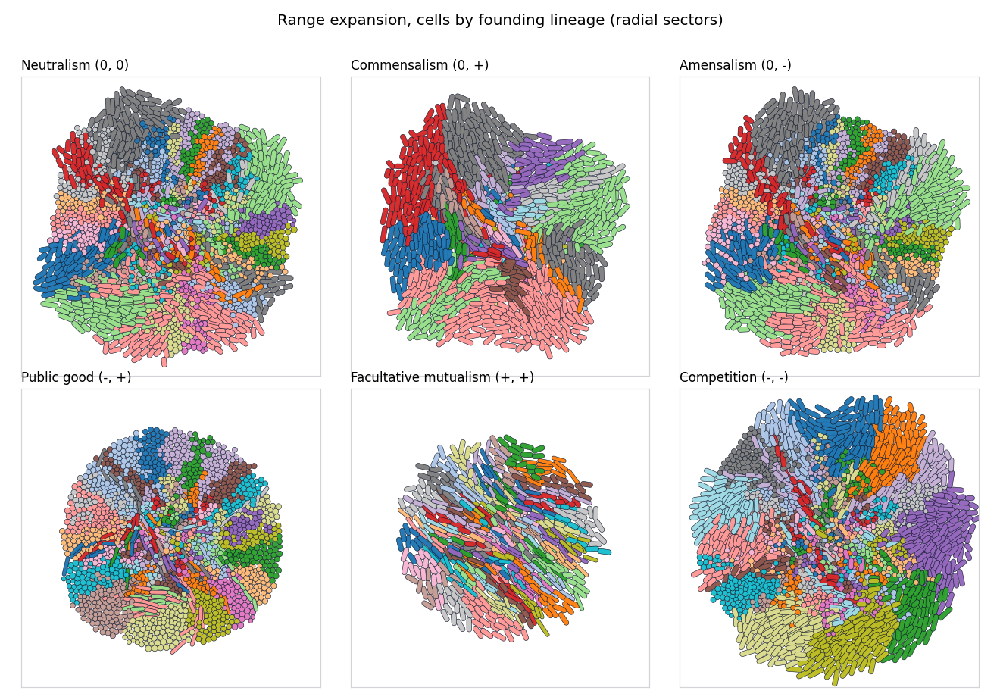

## Spatial metrics, defined

All the numbers are measured at the growing edge of the colony, because that is
where the future of the colony is decided. To read the edge the model walks
around the rim in small angular steps, and in each step it takes the outermost
cell and records which founding cell it descends from. This gives a ring of
labels around the colony, one label per angle. Every metric below is read off
that ring.

| Metric | What it measures | How to read it |
| --- | --- | --- |
| Lineage success rate | the share of a shape's founders whose descendants still sit on the rim at the end | higher means that shape reaches the growing edge more often |
| Median travel distance | how far a typical cell of that strain ends up from where it was born | higher means that strain is carried further as the colony grows |
| Mixing ratio (join-count) | how often two neighbours on the rim belong to different strains, compared with what random mixing would give | a value of 1 is as mixed as random, below 1 means the strains have sorted into clean single-strain wedges, near 0 is the cleanest separation |
| Sector width | the arc length of a typical wedge on the rim that belongs to one founding cell | wider wedges mean a few large clones hold the edge |
| Surviving sectors S | how many separate single-founder wedges are present around the rim | more wedges means the edge is broken into more pieces |
| Surviving lineages D | how many different founding cells still have descendants on the rim | higher means more of the starting diversity has survived to the edge |
| Sectors per lineage | S divided by D, the average number of wedges per surviving founder | 1 means each surviving founder holds one connected wedge, higher means its descendants are split into several wedges around the rim |

## Replicates and significance

Every comparison is run over independent replicates with different random seeds,
and the replicate count N is stated on each figure. The factorial uses N = 4
replicates per shape pair, the sector metrics N = 4 per shape, and the role
inversion N = 5 per group. Distributions are drawn as violins with the individual
replicate points overlaid, so the spread and the sample size are both visible; a
group whose replicates share one value is drawn as a level line with its points
on it. Significance is shown on the plots, not only in the text: the
by-interaction and metric figures carry a Kruskal-Wallis test across the three
shapes, and the inversion figures carry a Mann-Whitney bracket between role A and
role B for each shape, both with the convention ns, *, **, ***.

## Per-combination report

This section goes through the six interactions one at a time. A few plain terms
are used throughout. A founder is one of the cells in the starting seed, and its
lineage is all of its descendants. The front, or rim, is the outer growing edge
of the colony. Lineage success is the share of a shape's founders whose
descendants still sit on the rim at the end of a run, so it measures how often
that shape reaches the growing edge. A sector, or wedge, is a slice of the colony
spreading out from the centre that contains a single founder or a single strain.
When the two strains sort into single-strain wedges we say they segregate; when
they stay finely interleaved we say they mix.

Each interaction has a table. When the two sides of an interaction carry different
signs, the table lists every cell shape twice, once while that shape is on the
side with the first sign and once while it is on the side with the second sign,
so the same shape is measured under both signs. The column "role A vs B" is a
Mann-Whitney test that asks whether the shape does differently on the two sides.
The line under each table is a Kruskal-Wallis test that asks whether the three
shapes differ from each other, run for lineage success and for the spatial
metrics. Lineage success comes from the factorial runs, the spatial metrics from
the per-shape metric runs, both on the range-expansion model. Numbers are the
mean plus or minus one standard deviation over the replicates, with the sample
count n in brackets.

### Neutralism (0, 0)

Neither strain affects the other. Each one eats its own separate food and neither
leaks anything the other can use, so the only things happening are growth and
crowding. In the default run strain A is short rods and strain B is cocci. As the
colony grows out from the seed, the two strains drift apart into wedges purely by
chance. Cocci settle into a few wide, clean wedges, while rods and chains break
into more and finer wedges that interleave more at the edge. Both sides carry the
same sign here, so the only thing the swapped run changes is which shape sits on
which side, and the table lists each shape once.

| cell shape | lineage success (sign 0) | mixing jc | sector width xi | sectors S | lineages D |
| --- | --- | --- | --- | --- | --- |
| cocci | 0.46 ± 0.09 (n=24) | 0.25 ± 0.05 | 2.21 ± 0.12 | 43.25 ± 7.95 | 21.75 ± 1.09 |
| chain | 0.67 ± 0.12 (n=24) | 0.53 ± 0.03 | 1.96 ± 0.77 | 89.00 ± 6.96 | 30.00 ± 1.87 |
| rod | 0.65 ± 0.13 (n=24) | 0.35 ± 0.04 | 2.16 ± 0.43 | 58.75 ± 6.02 | 30.00 ± 2.92 |

Kruskal-Wallis across the three shapes: lineage success *** (p = 4.6e-14); mixing ratio ** (p = 0.0073); sector width ns (p = 0.74). Replicates: success N = 4 per shape pair, sector metrics N = 4 per shape.

Figures: `re_panels.png` (row 1), `re_factorial.png`, `re_success_byinteraction.png`, `re_mixing_byinteraction.png`, `re_inversion.png`, `re_inversion_analysis.png`, `re_rangeexp.gif` (panel 1).

### Commensalism (0, +)

One strain helps the other for free. The producer is the side with sign 0: it
eats the supplied food and leaks a by-product, and it is not affected by the other
strain. The consumer is the side with sign +: it cannot use the supplied food and
grows only on the leaked by-product, so it depends entirely on the producer. In
the default run the producer is short rods and the consumer is cocci. The producer
fills most of the area and the consumer survives only in the pockets where the
by-product has built up. The table measures each shape once as the producer and
once as the consumer. Whichever shape is the consumer reaches the rim far less
often than the same shape does as the producer, and all three drops are strong
(p below 0.0001). The side a cell is placed on therefore decides the outcome here,
which is why the test across the three shapes is not significant (p = 0.076): the
consumer role holds every shape back equally.

| cell shape | success as role A (sign 0) | success as role B (sign +) | role A vs B | mixing jc | sector width xi |
| --- | --- | --- | --- | --- | --- |
| cocci | 0.57 ± 0.06 (n=12) | 0.15 ± 0.10 (n=12) | *** (p=3.6e-05) | 0.26 ± 0.05 | 2.48 ± 0.22 |
| chain | 0.88 ± 0.07 (n=12) | 0.22 ± 0.19 (n=12) | *** (p=3.4e-05) | 0.54 ± 0.03 | 2.02 ± 0.42 |
| rod | 0.71 ± 0.09 (n=12) | 0.22 ± 0.14 (n=12) | *** (p=3.5e-05) | 0.42 ± 0.06 | 2.30 ± 0.13 |

Kruskal-Wallis across the three shapes: lineage success ns (p = 0.076); mixing ratio ** (p = 0.0097); sector width ns (p = 0.2). Replicates: success N = 4 per shape pair, sector metrics N = 4 per shape.

Figures: `re_panels.png` (row 2), `re_factorial.png`, `re_success_byinteraction.png`, `re_inversion.png`, `re_inversion_analysis.png`, `cube3d_inversion.png`, `re_rangeexp.gif` (panel 2).

### Amensalism (0, -)

One strain harms the other and is not affected itself. The maker is the side with
sign 0: it leaks a chemical that slows the other strain, and its own growth is
unchanged. The target is the side with sign -: it grows on its own separate food
but is slowed wherever the inhibitor has built up. In the default run the maker is
short rods and the target is cocci. The maker gains ground and the target is
pushed back along the line where the two meet. Moving a shape from one side to the
other changes its success very little here (none of the three role A versus B
tests are significant), so in this interaction the shape a cell has counts for
more than the side it is on. The three shapes do differ clearly from each other in
success (p below 0.0001).

| cell shape | success as role A (sign 0) | success as role B (sign -) | role A vs B | mixing jc | sector width xi |
| --- | --- | --- | --- | --- | --- |
| cocci | 0.45 ± 0.11 (n=12) | 0.42 ± 0.08 (n=12) | ns (p=0.51) | 0.24 ± 0.04 | 2.18 ± 0.11 |
| chain | 0.61 ± 0.10 (n=12) | 0.66 ± 0.15 (n=12) | ns (p=0.42) | 0.53 ± 0.02 | 1.78 ± 0.39 |
| rod | 0.61 ± 0.13 (n=12) | 0.62 ± 0.12 (n=12) | ns (p=0.98) | 0.44 ± 0.02 | 1.98 ± 0.22 |

Kruskal-Wallis across the three shapes: lineage success *** (p = 9.3e-07); mixing ratio ** (p = 0.0073); sector width ns (p = 0.2). Replicates: success N = 4 per shape pair, sector metrics N = 4 per shape.

Figures: `re_panels.png` (row 3), `re_factorial.png`, `re_mixing_byinteraction.png`, `re_inversion.png`, `re_inversion_analysis.png`, `re_rangeexp.gif` (panel 3).

### Public good (-, +)

One strain pays to make something the other gets for free. The producer is the
side with sign -: it spends part of its growth to release a shared good, so it
grows a little slower. The free-rider is the side with sign +: it pays nothing and
grows faster wherever the shared good is present. In the default run the producer
is long-rod chains and the free-rider is cocci. The free-rider gains ground on the
producer. For every shape, being the free-rider gives higher success than being
the producer, with the chains showing the largest gap (p below 0.0001). Part of
what could look like a shape effect here is really the growth cost carried by the
producer side.

| cell shape | success as role A (sign -) | success as role B (sign +) | role A vs B | mixing jc | sector width xi |
| --- | --- | --- | --- | --- | --- |
| cocci | 0.40 ± 0.12 (n=12) | 0.51 ± 0.06 (n=12) | * (p=0.03) | 0.25 ± 0.01 | 2.14 ± 0.11 |
| chain | 0.44 ± 0.14 (n=12) | 0.78 ± 0.10 (n=12) | *** (p=6.6e-05) | 0.55 ± 0.03 | 1.84 ± 0.74 |
| rod | 0.53 ± 0.12 (n=12) | 0.70 ± 0.11 (n=12) | * (p=0.011) | 0.41 ± 0.06 | 2.09 ± 0.35 |

Kruskal-Wallis across the three shapes: lineage success ** (p = 0.0016); mixing ratio ** (p = 0.0073); sector width ns (p = 0.94). Replicates: success N = 4 per shape pair, sector metrics N = 4 per shape.

Figures: `re_panels.png` (row 4), `re_factorial.png`, `re_success_byinteraction.png`, `re_inversion.png`, `re_inversion_analysis.png`, `cube3d_inversion.png`, `re_rangeexp.gif` (panel 4).

### Mutualism (+, +)

Each strain helps the other and both grow faster together. Each one leaks a
by-product the other needs, so a cell of either strain does best when it sits next
to the other strain. In the default run strain A is short rods and strain B is
long-rod chains. Because each strain has to stay close to the other to grow, the
two stay finely interleaved and do not sort apart, the wedges are the narrowest
of the six interactions, and the colony stays smaller because neither strain can
race ahead on its own. Both sides carry the same sign, so the swapped run only
changes which shape sits on which side, and the table lists each shape once.

| cell shape | lineage success (sign +) | mixing jc | sector width xi | sectors S | lineages D |
| --- | --- | --- | --- | --- | --- |
| cocci | 0.45 ± 0.09 (n=24) | 0.54 ± 0.04 | 0.86 ± 0.07 | 91.00 ± 6.60 | 41.00 ± 1.22 |
| chain | 0.61 ± 0.12 (n=24) | 0.84 ± 0.02 | 0.30 ± 0.01 | 136.50 ± 3.91 | 51.00 ± 1.87 |
| rod | 0.59 ± 0.13 (n=24) | 0.69 ± 0.05 | 0.35 ± 0.01 | 103.75 ± 7.73 | 48.50 ± 2.29 |

Kruskal-Wallis across the three shapes: lineage success *** (p = 1.5e-10); mixing ratio ** (p = 0.0073); sector width ** (p = 0.0073). Replicates: success N = 4 per shape pair, sector metrics N = 4 per shape.

Figures: `re_panels.png` (row 5), `re_factorial.png`, `re_sectorwidth_byinteraction.png`, `re_mixing_byinteraction.png`, `re_inversion.png`, `re_rangeexp.gif` (panel 5).

### Competition (-, -)

Both strains eat the same single food, so every cell that eats leaves less for its
neighbours, and each strain holds the other back. In the default run strain A is
cocci and strain B is short rods. As the colony grows out from the seed the two
strains sort into clean wedges, each wedge made of one strain only. This is the
sharpest separation of the six interactions, because sharing one food makes
neighbours of different strains compete hardest exactly where they touch. Both
sides carry the same sign, so the swapped run only changes which shape sits on
which side, and the table lists each shape once.

| cell shape | lineage success (sign -) | mixing jc | sector width xi | sectors S | lineages D |
| --- | --- | --- | --- | --- | --- |
| cocci | 0.43 ± 0.08 (n=24) | 0.21 ± 0.00 | 2.10 ± 0.10 | 35.25 ± 0.43 | 21.50 ± 1.12 |
| chain | 0.64 ± 0.13 (n=24) | 0.54 ± 0.05 | 1.78 ± 0.66 | 91.25 ± 8.61 | 32.25 ± 1.09 |
| rod | 0.63 ± 0.10 (n=24) | 0.39 ± 0.05 | 2.10 ± 0.37 | 66.00 ± 9.00 | 29.50 ± 2.69 |

Kruskal-Wallis across the three shapes: lineage success *** (p = 3.2e-16); mixing ratio ** (p = 0.0073); sector width ns (p = 0.79). Replicates: success N = 4 per shape pair, sector metrics N = 4 per shape.

Figures: `re_panels.png` (row 6), `re_factorial.png`, `re_success_byinteraction.png`, `re_mixing_byinteraction.png`, `re_inversion.png`, `re_rangeexp.gif` (panel 6).

## Separating cell shape from interaction sign

The factorial is the experiment that pulls apart the two things a strain carries:
its cell shape and its interaction sign. For every interaction the model runs all
nine ways of handing the three shapes to the two sides, each repeated several
times. Every strain in every run contributes one record holding its own shape, its
own sign, and how well it did. Collecting these records and grouping them gives,
for each shape and each sign, the average outcome. Reading down by shape with the
sign averaged out shows the effect of shape on its own. Reading across by sign with
the shape averaged out shows the effect of sign on its own. Whatever is left after
those two is the part that depends on the particular pairing of a shape with a
sign.

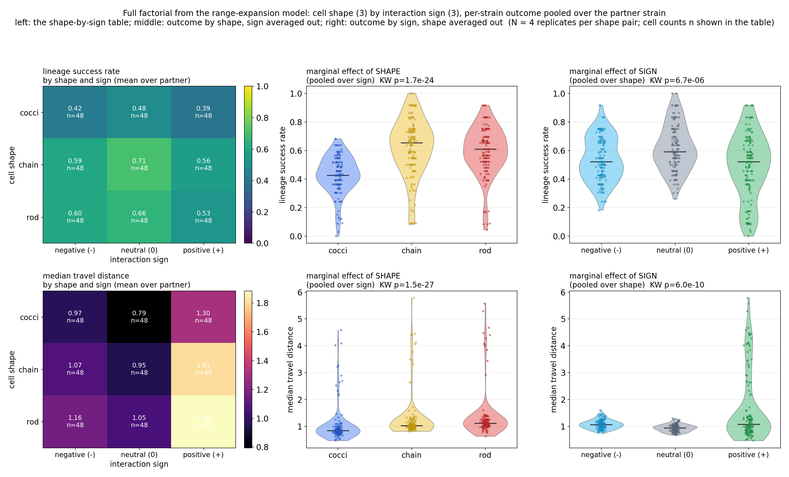

How to read this figure: the left column is a grid of the average outcome, with
the three cell shapes down the rows and the three interaction signs across the
columns. The middle column shows the outcome grouped by shape, with the sign
averaged out. The right column shows the outcome grouped by sign, with the shape
averaged out. Each dot is one replicate, and the p value at the top of each panel
is a Kruskal-Wallis test across the groups.

Reading the factorial:

1. **Shape effect.** Elongated cells (short rods and chained rods) reach the
   front more often than round cocci. Averaged over sign and partner, lineage
   success is about 0.42 for cocci and about 0.6 for both elongated shapes, with a
   Kruskal-Wallis p near 1.7e-24. The same ordering holds inside five of the six
   interactions. Commensalism is the exception, where the side a cell is placed on
   decides the outcome.

2. **Sign effect.** Strains in positive interactions reach the front less often
   and end up carried further than strains in neutral or negative ones, because a
   helping pair stays mixed together and depends on staying close, so neither side
   sorts into a clean wedge of its own.

3. **Combination.** In the public good the cost carried by the producer side can
   flip the order the shapes would show on their own, so the shape and the sign do
   not simply add up and have to be read together.

This is the result the repository is built to support: telling whether a spatial
outcome comes from the shape of the cells, from the ecological interaction they
were given, or from the two acting together.

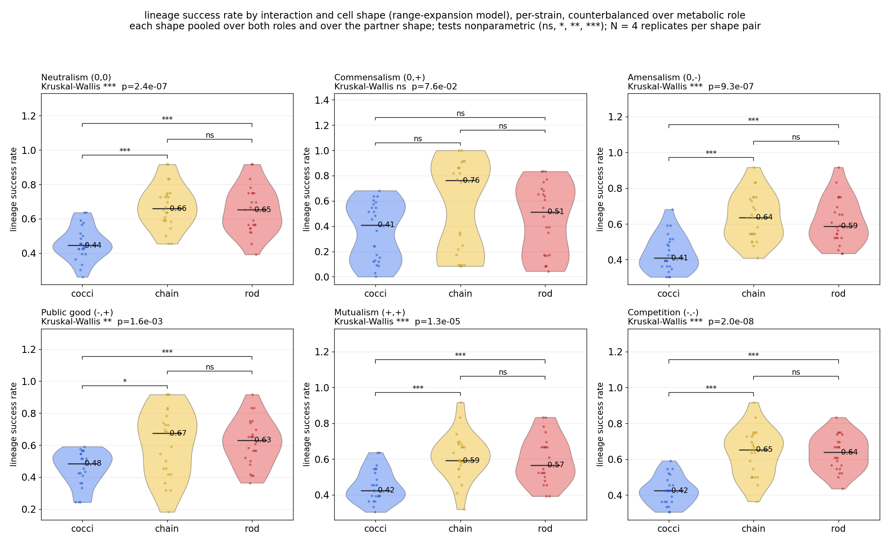

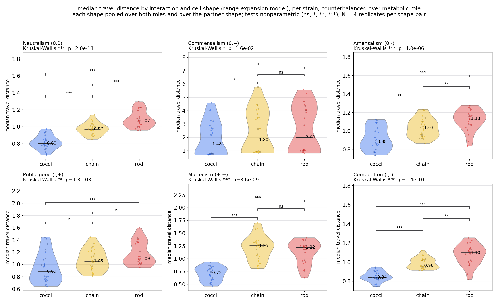

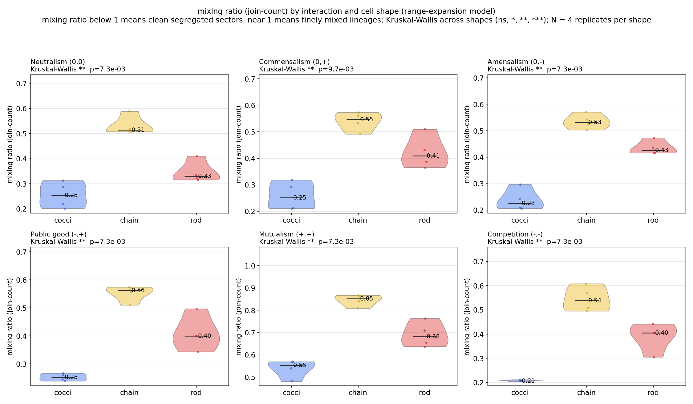

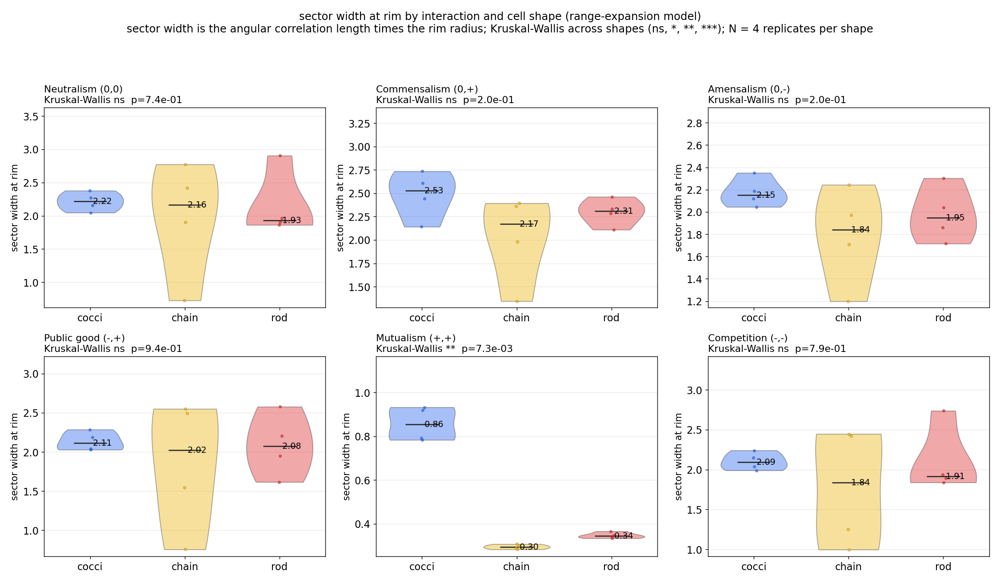

## Role inversion: each interaction with the cell shapes swapped between the roles

An asymmetric interaction gives a different sign to its two sides, and the panels
draw one shape on side A and the other on side B. With only that one assignment, a
difference in outcome could come from the cell shape or from the side the shape
was placed on, and the two cannot be told apart. To separate them, each
interaction is run a second time with the two cell shapes swapped between the
sides, so each shape spends one run carrying side A's sign and one run carrying
side B's sign.

    default   shape X -> side A (sign A),  shape Y -> side B (sign B)
    inverted  shape Y -> side A (sign A),  shape X -> side B (sign B)

This swap is run in both models. The cube version is in `cube3d_inversion.png` and
`cube3d_inversion_analysis.png`; the range-expansion version is in
`re_inversion.png` and `re_inversion_analysis.png`. How to read the analysis
figures: each panel shows one interaction, with four groups, the two shapes each
shown on side A and on side B. When a shape's two groups sit at the same height,
the sign made no difference to it. When they sit at different heights, the sign it
carried drove the outcome. Each analysis uses N = 5 replicates per group, stated
on every panel, and the bracket above each shape is a Mann-Whitney test of side A
against side B with its significance level (ns, *, **, ***).

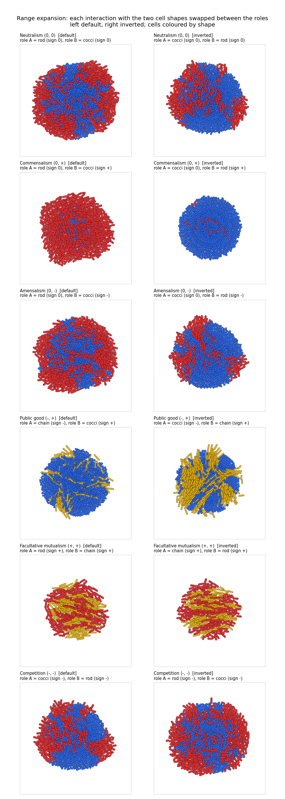

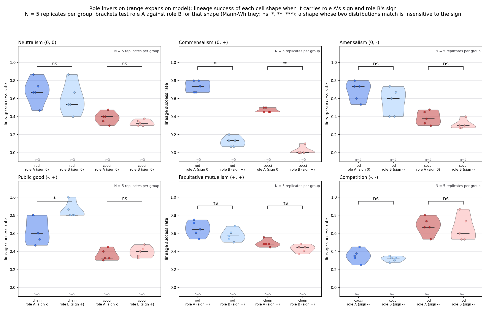

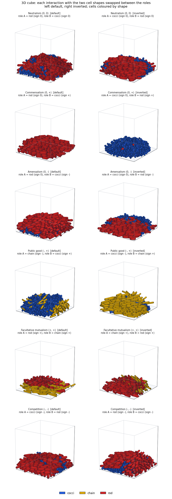

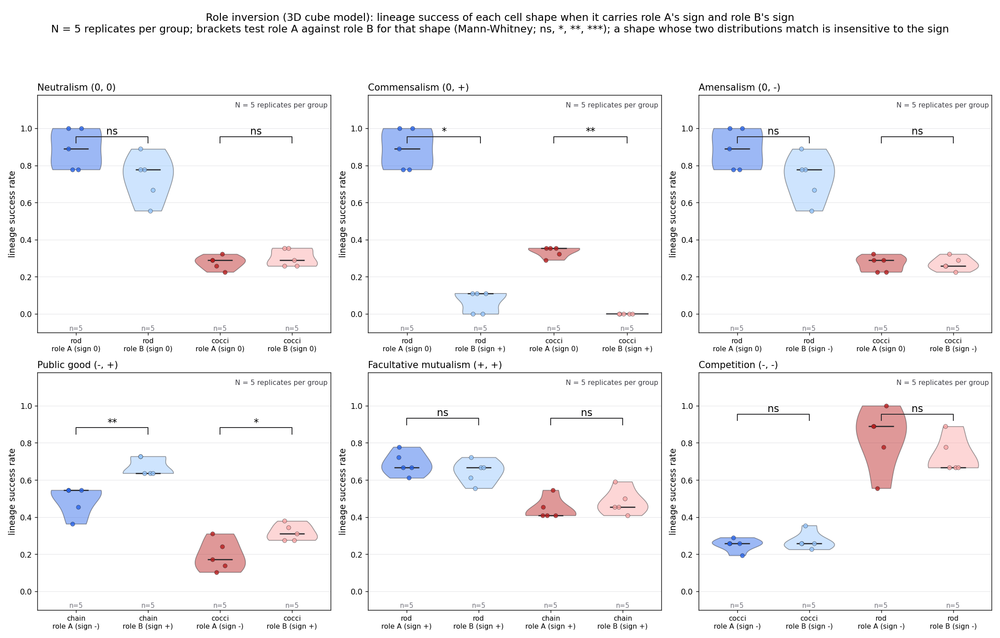

What the inversion shows, consistently in both models:

1. **Same sign on both sides means the side does not matter.** In neutralism
   (0,0), competition (-,-) and mutualism (+,+) the two sides carry the same sign,
   so swapping the shapes leaves each shape's success almost unchanged (side A
   against side B p above 0.1 in nearly every case). In these interactions the
   cell shape sets the outcome and the side a cell is on barely counts, which
   matches the factorial.

2. **Commensalism is set by the side, not the shape.** The consumer side grows
   only on the by-product the producer leaks, and it fails whichever shape holds
   it. In the range-expansion model the rod scores 0.73 as producer and 0.12 as
   consumer (p = 0.011), and the cocci 0.47 as producer and 0.02 as consumer
   (p = 0.0086); the cube model gives the same picture (rod 0.89 then 0.07, cocci
   0.34 then 0.00). This is why the factorial found no shape effect in
   commensalism: the consumer side holds every shape back. The cocci consumer
   reaching the rim in none of the replicates is a real exclusion, not a missing
   point; on the analysis figures those replicates sit together on a level line at
   zero.

3. **Public good favours the free-rider side.** The free-rider side (sign +, pays
   no cost) reaches the front more often than the producer side (sign -) for the
   same shape, in both models, so part of the shape pattern seen in the public
   good is really a side effect.

The swap confirms the factorial result from a second direction. When the two sides
of an interaction carry the same sign, the cell shape sets the spatial outcome.
When the two sides carry different signs, the side a cell is placed on can take
over, so the shape and the side have to be read together.

## Figures

These are the figures kept and shown in this README.

Integrated view, both models together:

- `integrated_panels.png`, every interaction as a 3D cube and as a 2D range
  expansion, each coloured by cell shape and by founding lineage.
- `integrated_rangeexp.gif`, the cube and the range expansion growing together by
  lineage, for all six interactions.

Range-expansion model:

- `re_panels.png`, for each interaction the cells by shape, the nutrient field
  with the cell contours on top, and the cells by founding lineage.
- `re_lineage_panels.png`, the final colonies of all six interactions by lineage.
- `re_rangeexp.gif`, the six interactions growing, coloured by shape.

Analysis, computed from the range-expansion model, with the cube shown alongside
for the swap:

- `re_factorial.png`, cell shape against interaction sign.
- `re_success_byinteraction.png` and `re_travel_byinteraction.png`, lineage
  success and travel distance by interaction and shape.
- `re_mixing_byinteraction.png` and `re_sectorwidth_byinteraction.png`, the two
  sector metrics by interaction and shape.
- `re_inversion.png` and `re_inversion_analysis.png`, each interaction with the
  two shapes swapped between the sides.
- `cube3d_inversion.png` and `cube3d_inversion_analysis.png`, the same swap run in
  the cube model.

The cube model also appears as the overview `cube3d_multipanel.png` at the top of
this README and throughout the integrated view.

## Animations

Git space is limited, so only the essential animations are kept in the
repository:

- `figures/integrated_rangeexp.gif`, the cube and the range expansion growing
  together, coloured by founding lineage, for all six interactions.
- `figures/cube3d_multipanel.gif`, the six interactions as 3D range expansions,
  cells coloured by shape.
- `figures/re_rangeexp.gif`, the six interactions as a 2D range expansion, cells
  coloured by shape with the same colour code (cocci blue, chain yellow, rod red).

The full set of animations and all PNG figures is provided outside the repository
in the delivery archive, so nothing is lost from the version kept under Git.

## Install

```bash
pip install -r requirements.txt
```

NumPy, SciPy, Matplotlib and Pillow, on Python 3.9 or newer.

## Run

Regenerate everything in reading order:

```bash
python scripts/run_all.py            # full
python scripts/run_all.py --quick    # fewer replicates, faster
```

Run a single stage:

```bash
# 3D cube model
python scripts/make_cube3d.py
python scripts/make_cube3d_shapes.py

# range-expansion model
python scripts/make_re_panels.py

# role inversion (cell shapes swapped between roles), both models
python scripts/make_cube3d_inversion.py 4
python scripts/make_re_inversion.py 4

# spatial metrics, from the range-expansion model
python scripts/make_re_factorial.py all 4
python scripts/make_re_factorial.py --plot
python scripts/make_re_metrics.py 5
```

## References

- Dolinsek J, Goldschmidt F, Johnson DR. Synthetic microbial ecology and the dynamic interplay between microbial genotypes. FEMS Microbiology Reviews 40(6):961-979 (2016).
- Blanchard AE, Lu T. Bacterial social interactions drive the emergence of differential spatial colony structures. BMC Systems Biology 9:59 (2015).
- Hallatschek O, Hersen P, Ramanathan S, Nelson DR. Genetic drift at expanding frontiers promotes gene segregation. PNAS 104:19926-19930 (2007).
- Smith WPJ, Davit Y, Osborne JM, Kim W, Foster KR, Pietsch JHJ. Cell morphology drives spatial patterning in microbial communities. PNAS 114:E280-E286 (2017).
- Volfson D, Cookson S, Hasty J, Tsimring LS. Biomechanical ordering of dense cell populations. PNAS 105(40):15346-15351 (2008).
- Bhattacharjee T, et al. Confinement and growth in three-dimensional bacterial colonies. Nature Communications (2024).
- Ciccarese D, Micali G, Borer B, Ruan C, Or D, Johnson DR. Rare and localized events stabilize microbial community composition and patterns of spatial self-organization in a fluctuating environment. The ISME Journal 16:1453-1463 (2022).

## License

MIT. See [LICENSE](LICENSE).
